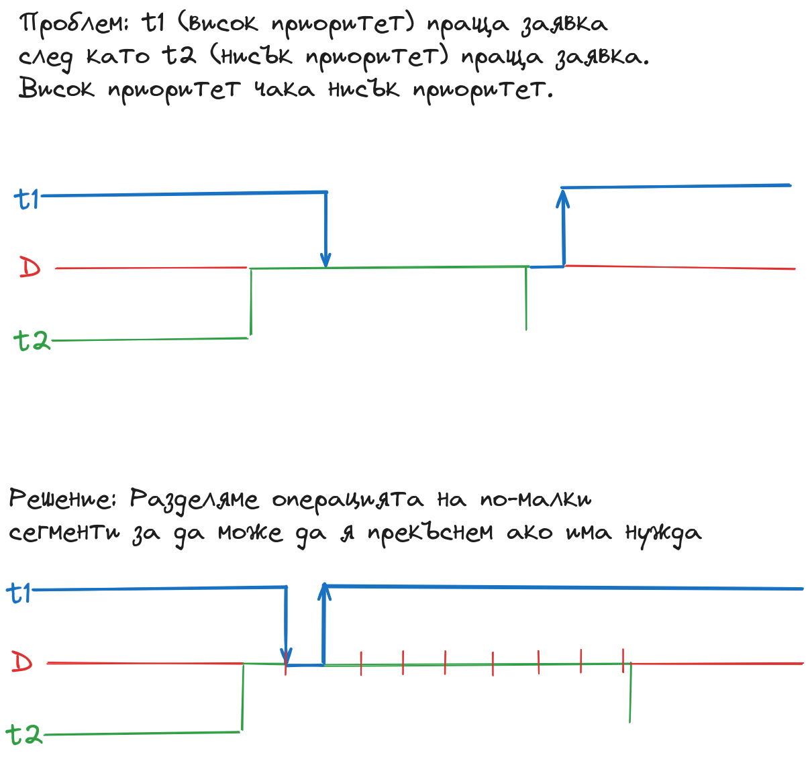

# Приоритетна инверсия

- От миналия път, но е важно
- TODO: записки

# Niceness - обратно на приоритета

- в Linux
  - Ако 2 еднакво приоритетни нишки имат различен niceness, тази с по-голям niceness ще се изпълнява по-често
- може да мандахерца приоритета
- намалява ако много време държи процесора
- вдига се за да се свали приоритета
- (приоритет := индекса в масива с опашки)

# Динамични приоритети

- Система с награди и наказание - след като приключи I/O получаваш boost, ако си държал процесора много време - намалява
- Принцип – максимално натоварване на I/O устройствата
- Приоритет може да стане дробно число
- Недостатъци:
    - Ако награждаваме I/O, бързи устройства boost-ват процесите, които работят повече от бавните устройства,
      следователно бързото устройство получава повече процесорно време

# Fair scheduling (CFS - Completely Fair Scheduler)

- В Linux
- "fair scheduling" - всеки процес получава равно процесорно време
- task switching през интервали от 10ms (примерно)
- Всяка нишка има идеално време за изпълнение на квант
- Нишките са подредени по оставащото им време от идеалното време
- Изпълнението се дава на този, който е "най-подценен" от време на работа
- Опитва се да даде тези с повече I/O та време по-често, като запази средното процесорно време равно за всички

# Стратегии за диска

- Разделяне на I/O-та на малки части за да може да се прекъсне нископриоритетна нишка и да се изпълни високоприоритетна

...

- Диспечера е стратегията за процесора

Случай:
- t1 (висок приоритет, малки I/O-та)
- t2 (нисък приоритет, големи I/O-та)

# Performance && Energy-efficient ядра

- В телефоните (и в новите лаптопи)
- Performance – няма значение тока, важно е да се изпълни бързо
  - Много дешифратори, много транзистори, възможно най-малко тактове
- Energy-efficient – важно е да се изпълни с възможно най-малко ток
  - Малко дешифратори, малко транзистори, възможно най-малко тактове
  - При батерии, мобилни устройства
- Има и двете в процесорите
- Обикновено са 1:1 пропорция като бройка

## Разпределение на квантовете по видовете ядра (scheduling отговорност)
- В зависимост от приоритетите?
- Крис предложи нещо, питай го за това
- Каква е нашата цел? 
  - Throughput? -- да натоварим всички (високи приоритети може би по-на performance)
  - Energy? -- повече на energy-efficient (да използваме ли изобщо performance ядра?)

---

**За следващия път:** Прекъсвания и обработка на прекъсванията
